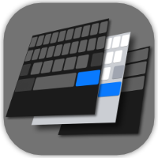
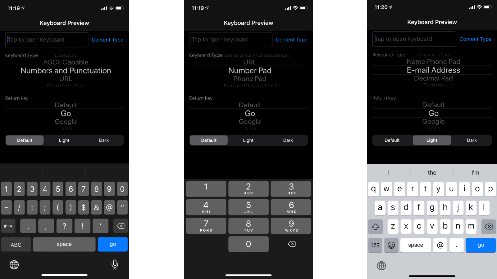

# Keyboard Preview

### Quickly preview available keyboard options with your language in iOS.

I wanted faster way to try out different available keyboard types, return keys and content types without having to set it, launch the app I was working on, tap through it to screen with specific `TextField` and then finally check how the keyboard looks...

With **Keyboard Preview** you can quickly preview all available options on single screen and can check out, how the keyboard looks like for different options.

PS: I also have [small app](https://github.com/nemecek-filip/DynamicType-ReferenceApp) to preview Dynamic Type fonts.

